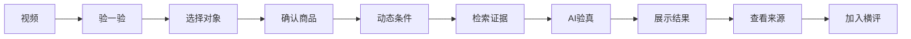

# 产品流程

```mermaid
flowchart LR
    A[视频] --> B[验一验]
    B --> C[选择对象]
    C --> D[确认商品]
    D --> E[动态条件]
    E --> F[检索证据]
    F --> G[AI验真]
    G --> H[展示结果]
    H --> I[查看来源]
    I --> J[加入横评]
```

第一版中 F、G 使用 Mock 接口，确保页面、请求和数据结构先稳定下来。

