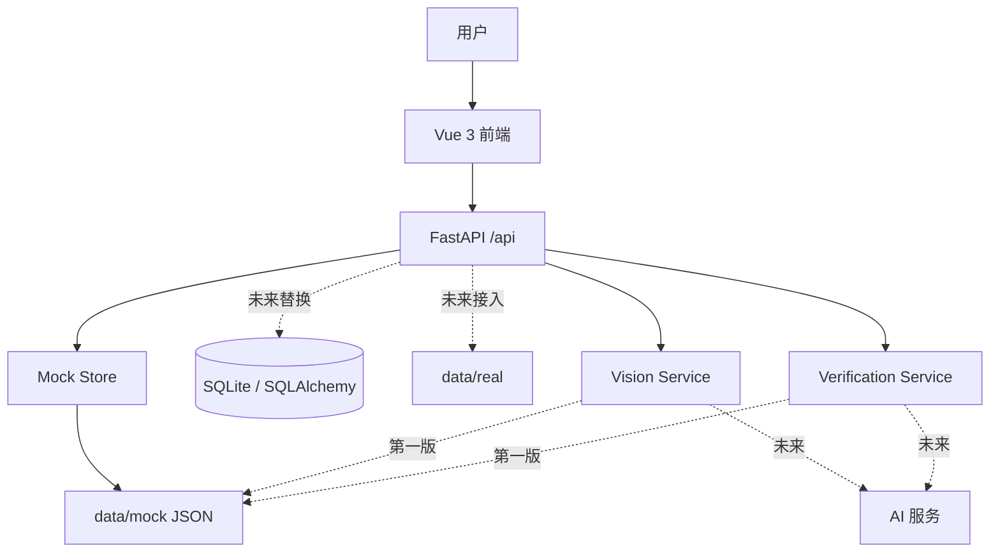

# 系统架构

```mermaid
flowchart TB
    U[用户] --> FE[Vue 3 前端]
    FE --> API[FastAPI /api]
    API --> STORE[Mock Store]
    STORE --> MOCK[data/mock JSON]
    API -.未来替换.-> DB[(SQLite / SQLAlchemy)]
    API -.未来接入.-> REAL[data/real]
    API --> VISION[Vision Service]
    API --> VERIFY[Verification Service]
    VISION -.第一版.-> MOCK
    VERIFY -.第一版.-> MOCK
    VISION -.未来.-> AIS[AI 服务]
    VERIFY -.未来.-> AIS
```

前后端通过 `docs/04-api-contract.md` 中的统一响应格式通信。Mock Store 集中处理 JSON 读取，后续可以替换为 SQLite 或真实检索服务。

