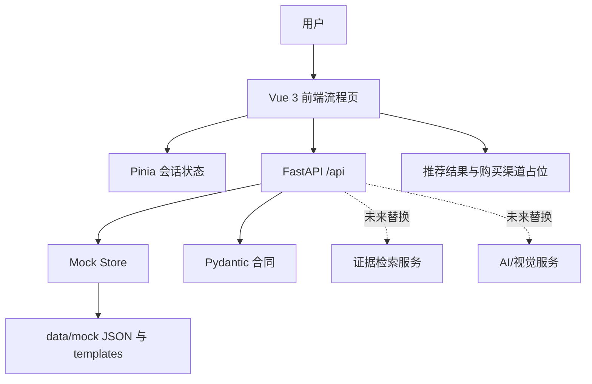

# 系统架构

前端通过共享 TypeScript 类型、后端 Pydantic Schema 和 `docs/04-api-contract.md` 对齐。Pinia 保存视频、圈选结果、候选商品、待分析需求、当前推荐轮次和上一轮反馈，保证再推荐可以继承条件。

Mock Store 负责读取联调 JSON；`data/mock/templates/` 只提供负责人后续填充的空模板和编号规则。未来可将检索、视觉识别、推荐生成和渠道服务替换为真实实现，但本轮不接入真实抖音 API、支付或购买跳转。
